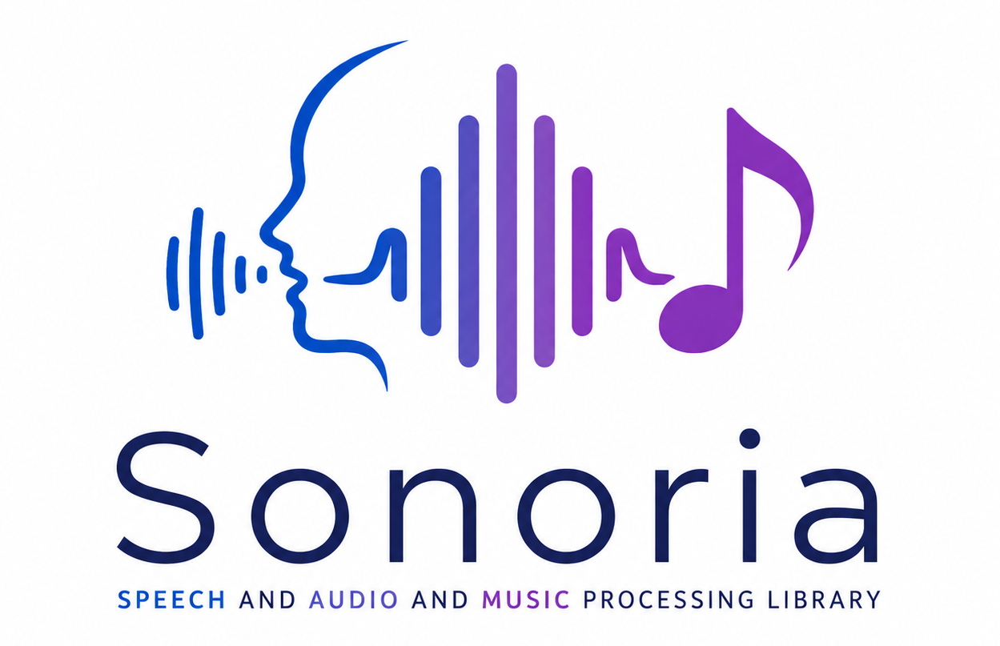

Sonoria
=======
[](https://github.com/MTG/sonoria/actions/workflows/build-wheels-cibuildwheel.yml)
[](https://www.gnu.org/licenses/agpl-3.0)

**Sonoria** is a fork of the Sonoria library, focused on speech and audio processing with an emphasis on the C++ API and examples. It contains an extensive collection of reusable algorithms which implement audio input/output functionality, standard digital signal processing blocks, statistical characterization of data, and a large set of spectral, temporal, tonal and high-level audio descriptors. 

This fork prioritizes:
- **Speech and audio processing** applications
- **C++ API** with comprehensive examples
- **Modern build system** using CMake with cross-platform support
- **Static library builds** for easy integration
- **Clean namespace** (sonoria) to avoid conflicts with the original Sonoria library

Original Sonoria documentation: http://sonoria.upf.edu


Installation
------------

The library is cross-platform and supports Linux, macOS, Windows, iOS and Android systems. This fork uses CMake as the primary build system.

**Building with CMake:**

```bash
mkdir build && cd build
cmake .. && make -j$(nproc)
```

For static library builds:
```bash
cmake -DBUILD_STATIC=ON ..
```

To configure dependency paths interactively:
```bash
cmake-gui ..
```

See [CMAKE_BUILD.md](CMAKE_BUILD.md) for detailed installation instructions.


Quick start
-----------

**C++ Examples:**

This fork focuses on providing comprehensive C++ examples for speech and audio processing. Check the `src/examples` directory for usage examples of various audio analysis algorithms.

Basic example:
```cpp
#include <sonoria/algorithm.h>
#include <sonoria/streaming.h>

using namespace sonoria;
using namespace sonoria::standard;

// Create and configure an algorithm
Algorithm algo("MFCC");
algo.configure("numberBands", 40);
```

**Note:** If you are migrating from Essentia to Sonoria, be aware that the namespace has changed from `essentia` to `sonoria`. Update your code accordingly:
- Change `#include <essentia/...>` to `#include <sonoria/...>`
- Change `using namespace essentia;` to `using namespace sonoria;`
- Change `essentia::` to `sonoria::`


You are also more than welcome to suggest any improvements, including proposals for new algorithms, etc., by creating issues in this repository.

